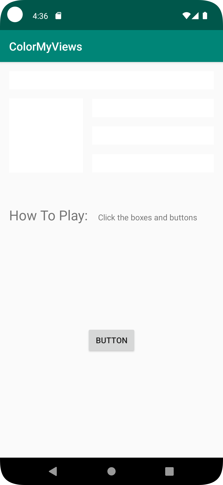
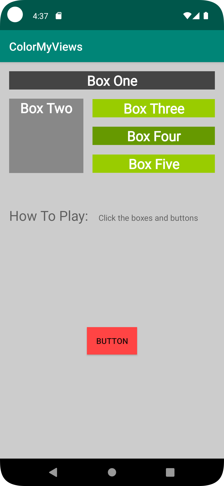

# Android Color My Views App
<h2>Contents</h2>

This is an android app containing concepts of
1. View Hierarchy and contraintLayout
1. Styling different layouts and views
1. Adding clickListeners to different views


## Installation
Clone this repository and import into **Android Studio**
```bash
git clone https://github.com/affi1504/Color_my_views_app.git
```

<h3>Building by downloading .zip and using Android Studio...</h3>

1. Dowload the .zip file by clicking *Code* -> Download ZIP
1. Extract the .zip file
1. Open Android Studio
1. select *Open*
1. Select the **color_my_views_app** directory.
1. Ensure the Project gets build and in case the IDE asks to sync *click* **Sync Now**.
1. Run the App using a Physical device or Emulator

# Screenshots
[](screenshots/Screenshot_1.png)

[](screenshots/Screenshot_2.png)

